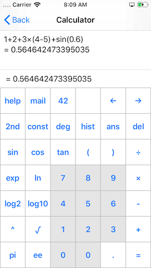

# SwiftUIExperiments
Experiments with SwiftUI

# Calculator

## Related SwiftUI Bugs

The alignment of the `0` button to the leading edge of `1` and the trailing edge of `2` is not easy. All my attempts resulted in broken layout. For the moment I decided to add a second `0` button. I guess with version 1.0 or 2.0 of SwiftUI there will be easy solutions to align the buttons to each other.

# iOS Calculator

## Related SwiftUI Bugs

See the alignment bug from the calculator above. In addition there is a space bug resulting in a white space between the label and the buttons. I expect that to be solved before SwiftUI 1.0 ships.

# Profile

## Related SwiftUI Bugs

The resizing of images is totally broken. I have no idea how Apple manages to get it to work in their session demos. It doesn't work at all in the first beta.

# Twitter Feed

## Related SwiftUI Bugs

See the bugs for the Profile.

# Mail Inbox

## Related SwiftUI Bugs

Same alignment bug as for the calculator. Therefore the subject an the text are not aligned to the sender.

# Author

Dominik Hauser

Follow me on [Twitter](https://twitter.com/dasdom) or add my [blog](https://dasdom.github.io) to you RSS reader.

# Licence

MIT

See the Licence file.
